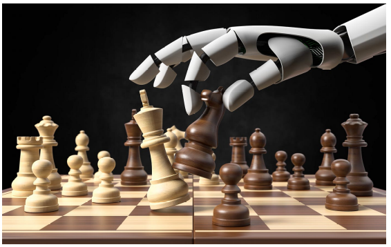

# Disclaimer

\input{../disclaimer.tex}

---

# Paper 1

\begin{center}
\includegraphics[width=0.85\columnwidth]{imgs/paper1.png}
\end{center}

[@mcgrath2022acquisition]

---

# Learning from machines (AlphaZero)

:::: columns
::: column

- Most methods we have looked so far try to interpret algorithms trained on human-generated data and labels
    - These interpretations may resemble human-understandable representations only because they learned from such data
- Can we interpret what the algorithms has been learning through its self-play training process?

:::
::: column

:::
::::

---

# Learning from Machines: Three-Pronged Acquisition

- **Probe for concepts**
  - How closely is AlphaZero's internal representation **related to** chess concepts humans have already created?
  - Detection of human concepts from network activations
- **Study behavioral changes**
  - How do changing representations give rise to changing behaviors?
  - Evolution of AlphaZero vs. human's strategy in openings
- **Investigate activations directly**
  - Unsupervised methods using non-negative matrix factorization (NMF) and direct measure of covariance to discover concepts not represented by humans in the past

---

# Interpretability

**Concept-based (post-hoc) interpretability**

- **Network probing:** detect human concepts from internal activations
  using linear classifiers (*concept activation vectors*)
- **Important features:** which concepts matter most for model predictions?
- **Mechanistic understanding:** what algorithms do individual layers implement?
- **Key challenge:** probing measures *correlation*, not *causation* —
  a concept linearly decodable from activations may not causally drive behavior

**Explainability in reinforcement learning**

- **Structural causal models:** simulate interventions on actions
  to answer counterfactual questions (*what if a different move was played?*)
- **Reward difference explanations:** why was action $a$ chosen over $a'$?
  Quantify the expected reward gap
- **Behavioral trajectory analysis:** identify critical decision points
  where the agent's policy changes most dramatically

---

# Chess as Testing Ground for AI Interpretability

Can humans learn the machine's strategy?

- Does not rely on human-labeled data
- Tree-based organization / saliency maps
- Natural language processing to generate move-by-move commentary
- **This paper:** captures "intuitive" aspect of chess play by understanding networks that produce value assessment (**v**) and candidate move (**p**)

$$\mathbf{p},\ v = f_\theta(\mathbf{z}^0)$$

## In plain English

$\mathbf{z}^0$ is the board position fed to the network; $\mathbf{p}$ is
a probability distribution over legal moves (what AlphaZero *wants* to play),
and $v \in [-1, 1]$ is its estimate of who is winning.
The question of the paper is: *what does $f_\theta$ know about chess
to produce these outputs?*

---

# AlphaZero: Network Structure and Training {.fragile}

:::: columns
::: column

\includegraphics[width=.9\columnwidth]{imgs/alphazero_network.png}

:::
::: column

$$\mathbf{p},\ v = f_\theta(\mathbf{z}^0)$$

\vspace{0.4cm}

$$\mathbf{z}^l = f^l(\mathbf{z}^{l-1}) = \text{ReLU}\!\left(\mathbf{z}^{l-1} + g^l(\mathbf{z}^{l-1})\right)$$

\vspace{0.4cm}

$$\mathbf{z}^l = f^{1:l}(\mathbf{z}^0) = f^l \circ \cdots \circ f^2 \circ f^1(\mathbf{z}^0)$$

:::
::::

---

# AlphaZero: Network Structure and Training {.fragile}

:::: columns
::: column

\includegraphics[width=.9\columnwidth]{imgs/alphazero_network.png}

:::
::: column

## In plain English
In the diagram, each box in the red rectangle is one residual block.
The **"add; ReLU"** arrow inside each box is where the network adds
the unmodified input to the learned transformation — instead of
replacing it. This repeats 20 times, building progressively more
abstract representations of the board.

:::
::::

---

# Probing for Concepts - Encoding of Human Conceptual Knowledge {.fragile}

\fontsize{11pt}{10pt}
\textbf{Question:} Can human concepts be easily predicted from the network's internal representation?

\textbf{Concept:} User-defined function mapping network input to real line:

$$c(\mathbf{z}^0) = \begin{cases} 1 & \text{if } \mathbf{z}^0 \text{ contains a bishop-pair U+2657 for the playing side} \\ 0 & \text{otherwise} \end{cases}$$

\textbf{Approach:} Train a sparse linear regression model from activations $\mathbf{z}^l$ at layer $l$ and training step $t$ to human concept $j$

\fontsize{9pt}{8pt}
:::  columns
:::: column
## In plain English
A *concept* is any chess idea a human can define on a board position —
from simple material facts (does the player have the bishop pair?)
to complex positional ideas (is the king safe?).
If a simple linear model can predict $c_j$ from $\mathbf{z}^l$,
the concept is **linearly encoded** in that layer.
::::

:::: column
## Key Insight
The network was never explicitly trained to represent chess concepts —
it only learned to predict moves and outcomes via self-play.
Finding linearly decodable concepts means AlphaZero **spontaneously
developed human-like internal representations**.
::::
:::

---

# Probing Concept Learning: Details {.fragile}

- **Data:** Randomly sample training, validation, test data from ChessBase archive, compute concept values and AlphaZero activations
- **Procedure:** For concept $i$, layer $l$, training step $t$, solve:

$$\mathbf{w}_{jlt},\ b_{jlt} = \min_{\mathbf{w},b} \frac{1}{N}\left\|\mathbf{w}^T \mathbf{Z}^l_t + b\mathbf{1} - \mathbf{c}_j\right\|^2_2 + \lambda\|\mathbf{w}\|_1 + \lambda|b|$$

- **Controls:** Regression from $\mathbf{z}^0$ and random concept regression
- **Evaluation:** $R^2$ value, fraction of variance in concept explained by network activation

:::  columns
:::: column
## In plain English
Fit a Lasso regression: predict concept $c_j$ from activations $\mathbf{z}^l$.
The $\ell_1$ penalty keeps only the **few neurons** that actually encode the concept.
::::

:::: column
## Key Insight
High $R^2$ = the concept is **linearly readable** from that layer.
Repeat for every layer $l$ and checkpoint $t$ $\rightarrow$ a map of *what, when, and where*
each concept is learned.
::::
:::

---

# Evolution of Human Concepts in AlphaZero 1/2

:::: columns
::: {.column width="27%"}
\begin{center}
\includegraphics[width=\columnwidth]{imgs/human_concepts_evolution.png}
\end{center}

:::
::: {.column width="60%"}

\vspace{1em}
Each surface is a *what–when–where* plot: probe $R^2$ as a function of
**network depth** (Block) and **training time** (Training steps).

- **x-axis:** training steps ($10^0$ → $10^6$) — *when* is it learned?
- **y-axis:** block index (1–20) — *where* in the network?
- **z-axis:** test accuracy — *how well* is the concept encoded?

:::
::::

---

# Evolution of Human Concepts in AlphaZero 2/2

:::: columns
::: {.column width="27%"}
\begin{center}
\includegraphics[width=\columnwidth]{imgs/human_concepts_evolution.png}
\end{center}

:::
::: {.column width="60%"}

\vspace{1em}
- A surface that rises early and stays high means AlphaZero learned
that concept **fast and robustly** (e.g. `in_check`).
- A surface that stays flat means the concept is **never linearly encoded** (e.g. `threats_t_ph` — still dark/purple throughout).

- Simple tactical concepts (`in_check`, `can_capture_queen`) emerge
**early and in middle layers**. Complex strategic concepts
(`total_t_ph`, `has_mate_threat`) require **more training steps**
and tend to concentrate in **deeper layers** — mirroring how
humans learn chess: tactics before strategy.

:::
::::

---

# Key Findings ---

1. **Grokking:** Most concepts emerge abruptly around **32,000 training steps** accuracy is near zero before, then jumps and stabilizes. AlphaZero does not learn gradually; it *clicks*.

2. **Information drop in deep layers:** for some concepts, probe accuracy
   *decreases* in the last blocks — the network re-encodes information
   in a less linearly-separable form as it approaches the output heads.

3. **Highly-distributed representations:** some concepts **cannot** be probed —
   sparsity forces the probe to use few neurons, but if the concept is
   spread across many neurons simultaneously, a sparse linear probe cannot
   recover it.

4. **Learning from errors:** positions where the probe fails systematically
   may reflect a genuine **"difference of opinion"** between AlphaZero
   and Stockfish — not a probe failure, but AlphaZero evaluating the
   position by a different (possibly superior) criterion.

## Key Insight
Findings 3 and 4 are honest about the method's limits:
absence of a detectable concept $\neq$ absence of the concept —
it may simply be encoded in a way a **linear probe cannot see**.

---

# Challenges for Concept Probing

1. What's the right **probing architecture**?
2. How should we interpret **complex or subjective concepts**?
3. When can we definitively say a **concept is represented**?
4. When we train a probe, we cannot tell if we are getting a **confounder or the concept** itself

---

\begin{center}
\vfill
\Large Progression through AlphaZero and Human History
\vfill
\end{center}

---

# Progression of Knowledge

- Recall: $\mathbf{p},\ v = f_\theta(\mathbf{z}^0)$

- **Question:** How does the progression of AlphaZero's knowledge compare to that of humans?
- **Key Findings:**
  - AlphaZero: Start from a uniform prior, then narrow down.
  - Humans: Start from a concentrated prior, then expand.

---

# Progression through Human History

\begin{center}
\includegraphics[width=0.88\columnwidth]{imgs/progression_human_history.png}

\vfill

Each color represents a first move (e.g. e4, d4, Nf3), with its area showing how often humans played it across history — serving as a reference to compare whether AlphaZero's training recapitulates or diverges from human chess evolution.

\end{center}

---

# Progression through AlphaZero History

\begin{center}
\includegraphics[width=0.88\columnwidth]{imgs/progression_alphazero_history.png}

\vfill

The three panels show \textbf{three independent AlphaZero training runs}: 
the distribution is remarkably consistent across runs --- AlphaZero converges 
to similar move preferences regardless of random initialization. Before 64,000 
steps, chaotic exploration dominates; after that, the distribution stabilizes 
abruptly (\textbf{grokking}). Compared to human history, AlphaZero settles on 
a mix of \texttt{d4} and \texttt{e4} but with a more diverse and volatile 
distribution --- \textbf{it does not recapitulate human chess history}, but 
finds its own path.

\end{center}

---

# Progression of AlphaZero's Chess Knowledge

**Methodology:** At different training checkpoints (up to 128k steps),
examine AlphaZero's move tendencies and concept probe accuracy.

> **Primary Takeaways**
>
> 1. AlphaZero learns standard opening theory **early** —
>    move preferences stabilize and match known theory within the first 64k steps
> 2. AlphaZero learns **material values before positional concepts** —
>    piece counts are encoded first; king safety and mobility come later
>
> **Both findings reinforce that AlphaZero learns basic human chess concepts first**

## Key Insight
This mirrors the curriculum of a human chess student:
openings and material counting are taught before strategic positional play.
AlphaZero rediscovers this ordering **from scratch**, via self-play alone —
with no exposure to human games or pedagogy.

---

# Opening Theory Knowledge

\begin{enumerate}
\item $\sim$30--60k: AlphaZero plays \textit{1. e4/d4} the majority of the time
\item $\sim$45k: AlphaZero considers \textit{2. d4} before opting for \textit{2. Nf3}
\item $\sim$45k: AlphaZero plays standard responses to \textit{1. e4}
\end{enumerate}

\begin{center}
\includegraphics[width=0.85\columnwidth]{imgs/opening_theory_plots.png}
\end{center}

- **Graph 1:** What move should White play to open the game?
- **Graph 2:** What should White play on move 2, after Black responds with `e5`?
- **Graph 3:** How should Black respond to White's opening move `e4`?

---

# Material vs. Positional Knowledge

::::: columns

::: {.column width="27%"}
\includegraphics[width=\columnwidth]{imgs/material_positional_plots.png}
::::

::: {.column width="60%"}

**Top — Material:**

The *relative value of pieces*, measured in pawns. Standard human values are: Queen=9, Rook=5, Bishop=3, Knight=3. AlphaZero independently rediscovers approximately these values by ~100k steps.

**Bottom — Positional concepts:**

- **Material:** piece count advantage
- **King Safety:** exposure to attacks
- **Mobility:** number of legal moves available
- **Space:** board control
- **Threats:** can capture next move
- **Imbalance:** asymmetric piece differences (e.g. bishop vs. knight)

::::

:::::

**The story they tell together:** AlphaZero first learns to count pieces (material, ~30k steps), and only later develops subtler positional concepts like king safety and mobility — exactly the order in which a human learns chess.

---

# Training Progression Assessment: GM Vladimir Kramnik

:::: columns

::: {.column width="80%"}

Qualitative evaluation by World Chess Champion Vladimir Kramnik,
who analyzed AlphaZero's play at three training checkpoints:

1. **16k to 32k steps:** understands material value in complex positions —
   knows which pieces are worth sacrificing and which are not

2. **32k to 64k steps:** develops king safety awareness in imbalanced positions —
   starts recognizing when the king is genuinely at risk

3. **64k to 128k steps:** combines king safety with material sacrifices
   in complex positions — a hallmark of grandmaster-level strategic play

:::

::: {.column width="18%"}

\includegraphics[width=\columnwidth]{imgs/kramnik_photo.png}

:::

::::

## Key Insight:

- Tactical skills appear to precede positional skills as AlphaZero learns
- This is a **human expert's qualitative confirmation** of what the concept
probes showed quantitatively: AlphaZero's learning curriculum —
material first, positional concepts later — mirrors how chess mastery
develops in humans.

---

\begin{center}
\vfill
\Large Exploring Additional Feature Detectors\\in AlphaZero Network
\vfill
\end{center}

---

# Exploring Activations with Unsupervised Methods

**Goal:** Find feature detectors embedded within the network —
*without* using predefined human concepts as supervision.

## In plain English
Unlike probing (which asks *"is concept X encoded here?"*),
these methods ask *"what patterns exist here?"* with no
human concept assumed in advance.

## Key Insight
If unsupervised methods independently recover human-like concepts,
it strengthens the case that AlphaZero's representations are genuinely
structured around chess knowledge — not an artifact of the linear probe design.

---

# Unsupervised Methods: Details

a) **Non-Negative Matrix Factorization (NMF):** decompose each layer's
   activations into a small set of additive factors — each factor
   represents a pattern of co-activating channels across board positions

b) **Input-activation correlation:** measure the covariance between
   each channel's activation and the raw input board —
   reveals which input features drive individual neurons

## Primary Takeaway

Individual layers and channels encode *feature detectors*
related to human-recognizable chess concepts —
discovered **without any concept labels**.

---

# Approach #1: Non-Negative Matrix Factorization

**Idea:** compress each layer's activations into $K < C$ interpretable factors,
then visualize each factor on the board to find *feature detectors*.

**Step 1:** Stack all activations for layer $l$ with $C$ channels:
$\hat{\mathbf{Z}}^l \in \mathbb{R}^{NHW \times C}$

**Step 2:** Factorize $\hat{\mathbf{Z}}^l \approx \mathbf{\Omega}_\text{all}\mathbf{F}$:

$$\mathbf{F}^*,\, \mathbf{\Omega}^*_\text{all} = \min_{\mathbf{F},\,\mathbf{\Omega}_\text{all}} \left\|\hat{\mathbf{Z}}^l - \mathbf{\Omega}_\text{all}\mathbf{F}\right\|^2_2 \qquad \mathbf{F},\ \mathbf{\Omega}_\text{all} \geq 0$$

- $\mathbf{\Omega}_\text{all} \in \mathbb{R}^{NHW \times K}$ — factor scores per board square
- $\mathbf{F} \in \mathbb{R}^{K \times C}$ — which channels compose each factor

**Step 3:** For each factor $k$ and input $n$, visualize $\mathbf{\Omega}_k$ on the board.

---

# Approach #1: Results

## In plain English
Each factor $k$ groups channels that fire together.
Plotting its scores on the board reveals *where* that pattern activates —
if it traces diagonals or controlled squares, the network learned that concept
without being told to.

## Key Insight
These patterns emerge with **no concept labels** —
NMF discovers structure purely from activation co-occurrence.
If the recovered factors resemble human chess concepts,
it independently confirms the probing results.

---

# Results: NN Matrix Factorization Analysis

\begin{center}
\includegraphics[width=0.70\columnwidth]{imgs/nmf_results.png}
\end{center}

---

# Approach #2: Input-Activation Covariance Analysis

**Idea:** for each channel $i$ in layer $l$, measure how strongly its
activation correlates with each input feature — then visualize on the board.

**Step 1:** Compute covariance between channel $i$'s activation $z^l_i$
and the raw input board $\mathbf{z}^0$:

$$\text{cov}(z^l_i, \mathbf{z}^0) = \mathbb{E}\left[z^l_i \mathbf{z}^0\right] - \mathbb{E}\left[z^l_i\right]\mathbb{E}\left[\mathbf{z}^0\right]$$

**Step 2:** Visualize $\text{cov}(z^l_i, \mathbf{z}^0)$ on the board to find *feature detectors*.

## In plain English
If a neuron fires whenever there is a bishop on a particular diagonal,
its covariance with those input squares will be high —
the map reveals *what the neuron is looking at* in the input.

## Key Insight
Unlike NMF (which finds group patterns across channels),
this method zooms into **individual neurons** —
asking *what specific input configuration drives this unit?*

---

# Results: Input-Activation Covariance Analysis

Detecting Move-Types from a Square:

\begin{itemize}
\item 1--2) Diagonal-Attacking Pieces (Queen, Bishop)
\item 3--4) Horizontally-Attacking Pieces (Queen, Rook)
\item 5) Both
\end{itemize}

\begin{center}
\includegraphics[width=0.82\columnwidth]{imgs/covariance_results.png}

\vfill

5 covariances with different channels for the square (5, 4) E4

\end{center}

---

# Conclusion: Key Findings (Paper 1)

1. Human-Defined Concepts can be regressed from the AlphaZero network
   - Despite never being trained on a human game of chess
2. As training progresses, AlphaZero understands basic concepts (openings, material) before more complex ones (king safety, mobility)
3. Feature Detectors of human-recognizable chess concepts are encoded by individual layers + channels in AZ Network
   - Can be found using supervised \& unsupervised techniques

---

# Limitations

1. Challenges for Concept Probing (previous section)
2. Knowledge acquisition is not complete --- only a very small part of the model
3. Interpreting ``Feature Detectors'' found via Unsupervised techniques
   - Inherently subjective
4. No Causal Insight into the Learned Concepts (only correlation)

---

# Future Research Areas

1. Addressing Concept Probing Limitations (more than sparse LR)
2. Can we go beyond finding human knowledge embedded in AlphaZero and understand what new concepts are learned?
   - Further analysis of feature detectors found with unsupervised techniques
3. How do we generalize these findings to other machine learning settings? Could we find human-recognizable concepts in different trained models?

---

# Discussion (Paper 1)

- How is this paper different from methods we discussed so far?
  - In terms of goals / techniques / specific models to explain
- Does this approach have potential applications for a more general setting other than board games?
  - What are the pros/cons of using games/artificial environments as baseline for evaluating RL algorithms?
- Can this be applied to our practice of doing science?
  - Can we recreate or extract theories using similar frameworks (AI for science)?
- How should we define or understand ``knowledge'' in these settings?
- How convinced are you about the ``interpretability'' aspect?
  - Who would be potential audience that could benefit from such analysis?

---

\begin{center}
\Large\textbf{What the DAAM:}\\
\Large\textbf{Interpreting Stable Diffusion Using Cross Attention}\\
\vspace{0.5cm}
\normalsize Tang, Liu, Pandey, Jiang, Yang, Kumar, Stenetorp, Lin \& Ture (2023)\\
\vspace{0.3cm}
\footnotesize Presented by: Alex Lin, Jason Jabbour, Mark Mazumder
\end{center}

---

# Outline

\begin{columns}
\begin{column}{0.48\textwidth}
\begin{itemize}
\item Related work
\item Background: Stable Diffusion
\item \textbf{DAAM} for text-to-image \textbf{attribution}
\item Results
  \begin{itemize}
  \item Attribution quality analysis
  \item Syntax to pixels
  \item Entanglement
  \end{itemize}
\item Limitations \& discussion
\end{itemize}
\begin{block}{}
DAAM estimates per-pixel attribution for each word in a prompt (post-hoc)
\end{block}
\end{column}
\begin{column}{0.48\textwidth}
\includegraphics[width=\columnwidth]{imgs/daam_intro.png}
\end{column}
\end{columns}

---

# Related Work

\begin{block}{}
This work applies existing techniques (cross-attention) to an \textbf{open source, SOTA} diffusion model to \underline{probe limitations}
\end{block}

- \textbf{Textual perturbation} (Wallace et al., 2019), Attentional Visualization, information bottlenecks to relate important input tokens to outputs of large LMs
- Probing \textbf{vision transformers for verb understanding} (Hendricks \& Nematzadeh, 2021)
- Enhancing diffusion models using \textbf{prompt engineering} (Hertz et al., 2020; Woolf, 2020)
- \textbf{Disentangling} e.g., style and spelling (Karras et al., 2019; Materzynska et al., 2022)
- Counterfactual explanations for \textit{text classification} (Jacovi et al., 2021) --- unclear how to extend to image generation

---

# Background: Generative Models

\begin{center}
\includegraphics[width=0.80\columnwidth]{imgs/generative_models_comparison.png}
\end{center}

\begin{columns}
\begin{column}{0.48\textwidth}
\begin{block}{}
\textbf{``Single-pass'' encoder-decoder}: GAN, VAE, Flow
\end{block}
\end{column}
\begin{column}{0.48\textwidth}
\begin{alertblock}{}
\textbf{Multi-step time-series}: Diffusion Models
\end{alertblock}
\end{column}
\end{columns}

---

# Background: Image Generation with Diffusion

\begin{center}
\includegraphics[width=0.78\columnwidth]{imgs/image_generation_unet.png}
\end{center}

A conditioning signal (e.g., ``7'') is embedded and fed into a \textbf{UNet} that predicts and subtracts noise iteratively.

---

# Background: UNet Architecture

\begin{center}
\includegraphics[width=0.68\columnwidth]{imgs/unet_architecture.png}
\end{center}

---

# Background: Forward and Reverse Process

\begin{center}
\includegraphics[width=0.88\columnwidth]{imgs/forward_reverse_process.png}
\end{center}

\begin{columns}
\begin{column}{0.48\textwidth}
\textbf{Forward process:} add noise for $T$ timesteps ($\epsilon \sim \mathcal{N}(0,1)$)
\end{column}
\begin{column}{0.48\textwidth}
\textbf{Reverse process:} denoising model $\epsilon_\theta(\text{image}, \text{timestep})$ reconstructs image
\end{column}
\end{columns}

---

# Diffusion Model Loss {.fragile}

$$L_{DM} = \mathbb{E}_{x,\,\epsilon\sim\mathcal{N}(0,1),\,t}\!\left[\left\|\epsilon - \epsilon_\theta(x_t,\, t)\right\|^2_2\right]$$

\begin{center}
\includegraphics[width=0.72\columnwidth]{imgs/ldm_with_latent.png}
\end{center}

\begin{alertblock}{}
Reasoning about noise in \textbf{pixel space} is challenging $\rightarrow$ use \textbf{latent space} instead!
\end{alertblock}

---

# Latent Diffusion Model Loss {.fragile}

$$L_{DM} = \mathbb{E}_{x,\,\epsilon\sim\mathcal{N}(0,1),\,t}\!\left[\left\|\epsilon - \epsilon_\theta(x_t,\, t)\right\|^2_2\right]$$

\vspace{0.3cm}

$$L_{LDM} := \mathbb{E}_{\mathcal{E}(x),\,\epsilon\sim\mathcal{N}(0,1),\,t}\!\left[\left\|\epsilon - \epsilon_\theta(z_t,\, t)\right\|^2_2\right]$$

\vspace{0.2cm}

- $\mathcal{E}(x)$: latent space encoder
- $z_t$: latent representation of image at time $t$
- Easier to estimate noise in latent space!

[@rombach2022ldm]

---

# Stable Diffusion Architecture

\begin{center}
\includegraphics[width=0.80\columnwidth]{imgs/sd_architecture.png}
\end{center}

$$L_{LDM} := \mathbb{E}_{\mathcal{E}(x),\,y,\,\epsilon\sim\mathcal{N}(0,1),\,t}\!\left[\left\|\epsilon - \epsilon_\theta(z_t,\, t,\, \tau_\theta(y))\right\|^2_2\right]$$

---

# Cross-Attention for Text Conditioning {.fragile}

$$\text{Attention}(Q, K, V) = \text{softmax}\!\left(\frac{QK^T}{\sqrt{d}}\right) \cdot V$$

$$Q = W_Q^{(i)} \cdot \varphi_i(z_t),\quad K = W_K^{(i)} \cdot \tau_\theta(y),\quad V = W_V^{(i)} \cdot \tau_\theta(y)$$

\begin{itemize}
\item \textbf{Queries:} image tokens (UNet block $i$)
\item \textbf{Keys, Values:} prompt tokens (text encoder $\tau_\theta$)
\end{itemize}

\begin{block}{}
DAAM estimates \textbf{per-word attribution} via this cross-attention \textbf{for each subset} of prompt tokens
\end{block}

---

# DAAM: Per-Word Heatmaps

\begin{center}
\includegraphics[width=0.82\columnwidth]{imgs/daam_heatmaps_method.png}
\end{center}

\begin{center}
\small Sum of cross-attention maps from TC-UNet for $T$ timesteps w.r.t. each token $\rightarrow$ overlay on generated image
\end{center}

---

# DAAM: Attention Maps Formula

\begin{center}
\includegraphics[width=0.90\columnwidth]{imgs/daam_formula.png}
\end{center}

\begin{center}
\small Sum across UNet blocks $i$, timesteps $j$, attention heads $\ell$ --- for both downsampling ($\downarrow$) and upsampling ($\uparrow$) blocks
\end{center}

---

# Results: Attribution Analysis Part 1 --- Object Attribution

We can evaluate DAAM as an image-segmentation tool

\begin{center}
\includegraphics[width=0.70\columnwidth]{imgs/object_attribution.png}
\end{center}

---

# DAAM Segments Stable Diffusion Images

\begin{columns}
\begin{column}{0.52\textwidth}
\includegraphics[width=\columnwidth]{imgs/segmentation_table.png}
\end{column}
\begin{column}{0.44\textwidth}
\begin{itemize}
\item DAAM does not require explicit segmentation labels
\item DAAM is ``open vocabulary'' --- can segment for \textbf{any text input} (not limited to known classes)
\item Competitive with unsupervised methods; lower than supervised
\end{itemize}
\end{column}
\end{columns}

---

# Results: Attribution Analysis Part 2 --- Generalized Attribution

DAAM can segment \textbf{beyond nouns}:

\begin{center}
\includegraphics[width=0.82\columnwidth]{imgs/generalized_attribution.png}
\end{center}

---

# Evaluating DAAM with a User Study

\begin{center}
\includegraphics[width=0.85\columnwidth]{imgs/user_study_results.png}
\end{center}

\footnotesize 50 annotators; none see more than 18\% of images. Every image has 3 raters. Abstract words / poor images excluded.

---

# Visuosyntactic Analysis

\begin{block}{Key Question}
How does \textbf{syntax} relate to the generated \textbf{pixels}?
\end{block}

- Study \textbf{head-dependent pairs} in sentences using Universal Dependencies (UD) syntax
- For each dependency relation, measure how much the attribution map of the \textit{dependent} overlaps with that of the \textit{head}
- 3 measures: mIoU, mIoD (Mean IoD over the \textbf{D}ependent), mIoH (Mean IoD over the \textbf{H}ead)

---

# Visuosyntactic Analysis: Head-Dependent Pairs

\begin{center}
\includegraphics[width=0.80\columnwidth]{imgs/visuosyntactic_head_dependent.png}
\end{center}

---

# Visuosyntactic Analysis: Measures of Overlap

\begin{columns}
\begin{column}{0.46\textwidth}
\includegraphics[width=\columnwidth]{imgs/measures_of_overlap.png}
\end{column}
\begin{column}{0.50\textwidth}
\textbf{Measures of Overlap}
\begin{itemize}
\item Mean Intersection over Union (mIoU)
\item Mean Intersection over the Dependent (mIoD)
\item Mean Intersection over the Head (mIoH)
\end{itemize}
\vspace{0.4cm}
$\text{mIoD} > \text{mIoH}$: dependent's map \textbf{subsumes} head's\\[0.2cm]
$\text{mIoD} < \text{mIoH}$: head's map \textbf{subsumes} dependent's
\end{column}
\end{columns}

---

# Visuosyntactic Analysis: Results

\begin{columns}
\begin{column}{0.40\textwidth}
\includegraphics[width=\columnwidth]{imgs/visuosyntactic_table.png}
\end{column}
\begin{column}{0.57\textwidth}
\includegraphics[width=\columnwidth]{imgs/visuosyntactic_examples.png}
\end{column}
\end{columns}

---

# Visuosyntactic Analysis: Key Takeaways

- \textbf{Noun Compounds} (``ice cream''): No dominance --- complement one another
- \textbf{Punctuation \& Articles} (``the donut''): No dominance --- little semantic meaning
- \textbf{Verb \& Subject} (\textit{bird stands}): Head verb \textbf{dominates} --- contextualises subject/object in surroundings (\textit{semi-intuitive})
- \textbf{Nominal Dependents} (``pile of oranges''): Head dominates --- \textit{intuitive}
- \textbf{Adjective Modifiers} (``wooden bench''): Dependent \textbf{dominates} --- \textit{counter-intuitive}

\begin{alertblock}{Summary}
Attribution map of the \textbf{dependent subsumes} that of the head, and vice versa for others. Dominance is intuitive in some cases but \textbf{counter-intuitive} in others.
\end{alertblock}

---

# Visuosemantic Analysis: Cohyponym Entanglement

\begin{block}{Key Question}
Do semantically \textbf{similar words} have \textbf{worse} generation quality?
\end{block}

\begin{columns}
\begin{column}{0.52\textwidth}
\includegraphics[width=\columnwidth]{imgs/cohyponym_results.png}
\end{column}
\begin{column}{0.44\textwidth}
\begin{alertblock}{Cohyponym: ``a giraffe and a zebra''}
\begin{itemize}
\item SD image generation \textbf{worsens}
\item Generates \textbf{one} noun but \textbf{not both}
\item Attribution maps \textbf{overlap} $\rightarrow$ Feature Entanglement
\end{itemize}
\end{alertblock}
\begin{exampleblock}{Non-Cohyponym: ``a zebra and a fridge''}
\begin{itemize}
\item Generates \textbf{both} nouns
\item Attribution maps are \textbf{distinct}
\end{itemize}
\end{exampleblock}
\end{column}
\end{columns}

---

# Visuosemantic Analysis: Adjectival Entanglement

\begin{block}{Setup}
Prompt: \texttt{``<adj> <noun> <verb phrase>''} (e.g., ``a [rusty] shovel sitting in a clean shed'')\\
If \textbf{no entanglement}, background should \textbf{not gain attributes} pertaining to that adjective
\end{block}

\begin{columns}
\begin{column}{0.48\textwidth}
\includegraphics[width=\columnwidth]{imgs/adjectival_results.png}
\end{column}
\begin{column}{0.48\textwidth}
\begin{alertblock}{Takeaway}
Attribution maps for adjectives attend \textbf{too broadly} across images, beyond the nouns they modify $\rightarrow$ \textbf{Feature Entanglement}
\end{alertblock}
\end{column}
\end{columns}

---

# Summary

- DAAM provides pixel-level attribution maps for Stable Diffusion, a state-of-the-art text-to-image generator
- These maps appear to be informative, as evaluated through segmentation tasks and user study
- DAAM can be a useful tool for further understanding and analyzing Stable Diffusion --- e.g. through visuosyntactic analysis and visuosemantic analysis

---

# Class Discussion

- Does DAAM give a clear understanding about how a large-scale latent diffusion model synthesizes text to image and which parts of an image are influenced the most?
- Does DAAM explain all the dynamics of how images are synthesized? If not, how should DAAM be modified to better explain image generation?
  - Other explanatory tools besides **attention** and **segmentation proposals**?
- DAAM pointed out failure cases of Stable Diffusion. Are there further interpretability methods needed to understand why **feature entanglement** is occurring and how it could be improved?

---

\begin{center}
\Huge Thank You!
\end{center}

---

# References {.allowframebreaks}

\footnotesize
